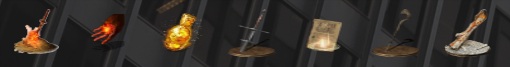

# Dark Souls App Icons

> Personalize your linux setup for dark souls vibes

  

### How to setup

 - Download this repo, and run `update_icons.sh`

### Notes

 - This update script is designed for Ubuntu 20/18, with Gnome 3 desktop environment, please modify this simple setup for you xfce/mate users etc.

 - This update script will change the icons specifically for google chrome, settings, filemanager, spotify, slack, VS code, and Terminator (my prefered terminal emulator) so please adjust for your apps.

 
